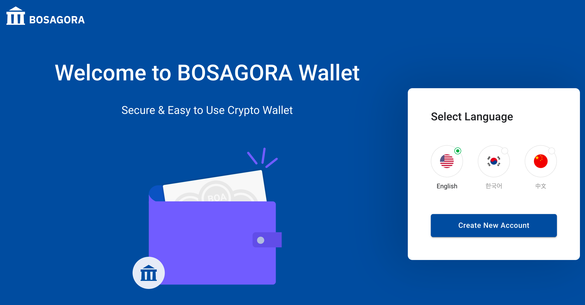
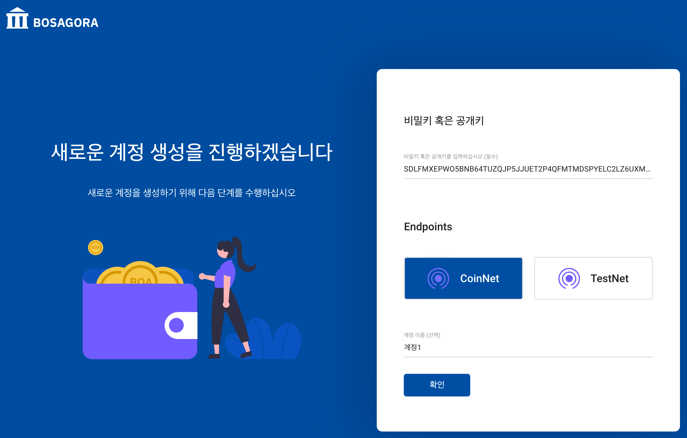
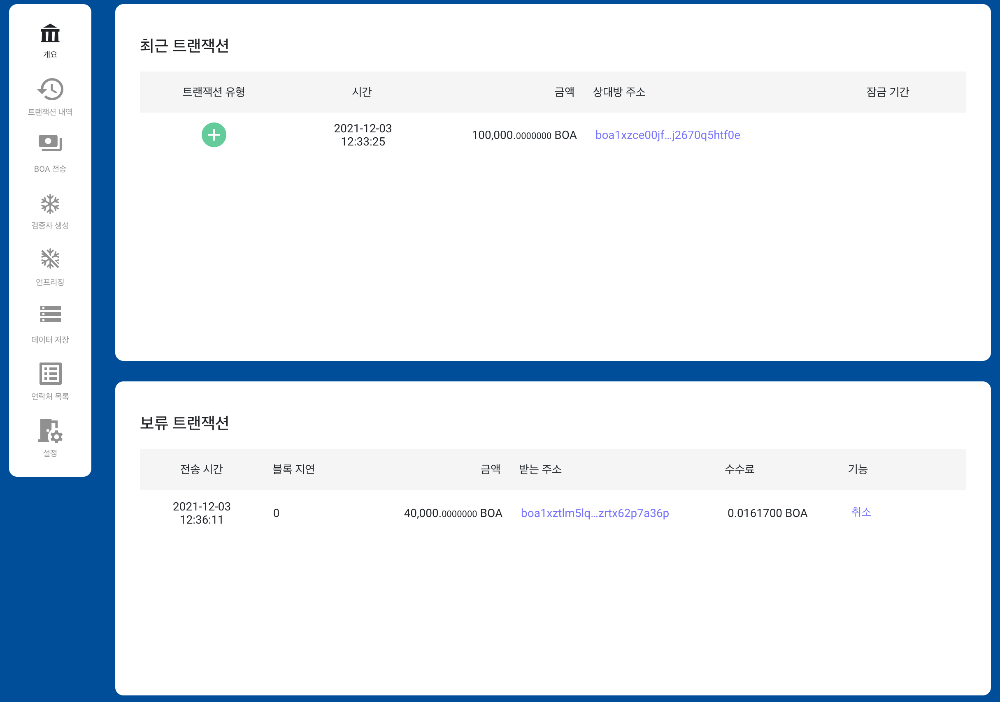
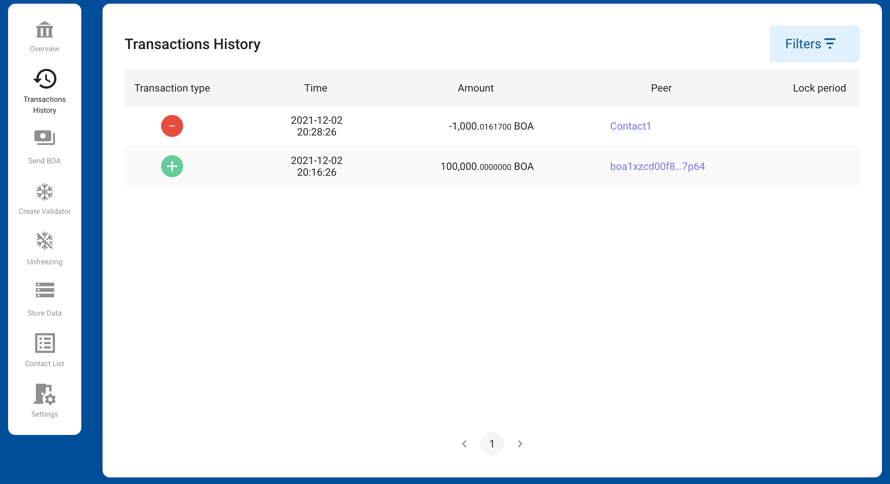

# Getting Started

## Login

When there is no registered account, The web wallet shows the login screen.  
You can choose a language here. 
Then, press the button Create New Account to move to the next screen. 
You can change the language using the menu Setting in the wallet.

You can start the wallet by entering a secret key or public key and the name of your account, 
and then pressing the button OK. 
If you don't have a secret key or a public key, you can generate a new key by pressing the button Create. 
The web wallet does not keep the secret key generated here. 
You must enter a secret key when logging on the web wallet again. 
If you haven't backed up your secret key, 
you won't be able to use the funds transferred to the account, so be extra careful.  
A detailed description of the account is provided in [Manage accounts](./01-introduction.md#manage-accounts).

## Menu
All screens have menus on the left. 
The menu includes Overview, Transactions history, 
Send BOA, Create Validator, Unfreezing, Store Data, Contact List, and Settings.

**Overview**

You can see the last 10 completed transactions and pending transactions of the selected account here.

**Transactions History**

You can see the past transactions of the selected account here. 

**Send BOA**

You can transfer funds from here to another account.

**Create Validator**

At least 40,000 BOA must be frozen to create a validator node in BOASGORA's network. 
You can freeze the funds here. In this process, additional keypairs are created for node operation. 
This key pair is used to set up nodes.

**Unfreezing**

The ability to release frozen funds is provided to create a validator. 

**Store Data**

You can store data in the blockchain here. 

**Contact List**

The contact is the address you often use when you transfer. 
Contacts make it easy for users to select addresses when transferring. 
Therefore, you can easily distinguish transaction details 
by the contact name registered in the contact instead of the other party's address.

**Setting**

You can set network, language, time zone, etc. here.

## Status bar

**Account selection**

You can choose one of several registered accounts.
You can also copy the public key of the account, delete the account, and add a new account.

**Network selection**

There are two networks in BOSAGORA. One is CoinNet, and the other is TestNet. 
CoinNet is a network in which actual coins with value are transmitted. 
TestNet is used to test, and the coins here do not have actual value.

**Balance**

The web wallet shows two types of balance. 
One is the balance of the selected account, 
and the other is the sum of all registered accounts. 
In addition, the balance can be subdivided into the following. 

* Total balance : This is the sum of all UTXOs held by the account. 
* Spendable balance: This is the sum of UTXO that can be spent on the account. 
* Frozen balance : The sum of the frozen UTXO. 
* Locked balance : This is the sum of UTXO that cannot be used for a certain period.   
There are two types of locked balances. 
The first is that the frozen UTXO is unfrozen, 
and the newly created UTXO is locked until 2016 new blocks are created. 
The second is the amount of UTXO used for the pending transaction. 
The UTXO consumed in the transaction is locked until the block containing it is externalized.

**Mode status**

The public key must be registered in your account, 
but the secret key may not be registered. 
The mode of the account where the secret key is registered is Sudo. 
The mode of the account where the secret key isn't registered is ReadOnly. 
The web wallet shows the number of Sudo, 
making it easy for you to figure out the number of secret keys registered on the web wallet.

## Overview

This screen consists of two areas: Recent Transactions and Pending Transactions.  

**Recent Transactions**

The web wallet only shows transactions in
which the address of the selected account among the recent transactions stored 
in the blockchain is the same as either the sender's address, or the receiver's address.  
The fields consist of Transaction type, Time, Amount, and Peer.  
The top record is the most recently generated transaction. 
When one record is selected, detailed transaction information is provided.   

* Transaction type are Inbound, Outbound, Freezing, and Payload. 
    + Inbound : Funds are added to the selected account. 
    + Outbound : Funds are withdrawn from the selected account.
    + Freezing : Used to create a validator.
    + Payload : Used to store data in the blockchain.
* Amount : The amount that was received, or spent.
* Peer : The address that sent (or received) the funds.

**Pending Transactions**

The web wallet only shows transactions in which 
the address of the selected account among the transactions waiting to be stored 
in the blockchain is the same as one of the sender's addresses.  
The fields consist of Submission time, Block delay, Amount, Target, Fee, and Action.  

* Submission time : Time at which Stoa received the transaction.  
* Block delay : Number of blocks externalized since then.  
* Amount : Amount that the target will receive.  
* Target : Receiver address, or name if known.  
* Fee : Fee posted for this transaction.  

Transactions that have not yet been saved in the block may be canceled. 
The success of transaction cancellation cannot be guaranteed 
because it may be stored in a block during the cancellation process.

## Transactions History

The web wallet only shows transactions in which the address of the selected account 
among the recent transactions stored in the blockchain is the same as either the sender's address, 
or the receiver's address.  
The fields consist of Transaction type, Time, Amount, and Peer.  
The top record is the most recently generated transaction. When one record is selected, 
detailed transaction information is provided.  

* Transaction type are Inbound, Outbound, Freezing, and Payload.
    + Inbound : Funds are added to the selected account. 
    + Outbound : Funds are withdrawn from the selected account.
    + Freezing : Used to create a validator.
    + Payload : Used to store data in the blockchain.
* Amount: The amount that was received, or spent.
* Peer: The address that sent (or received) the funds.

