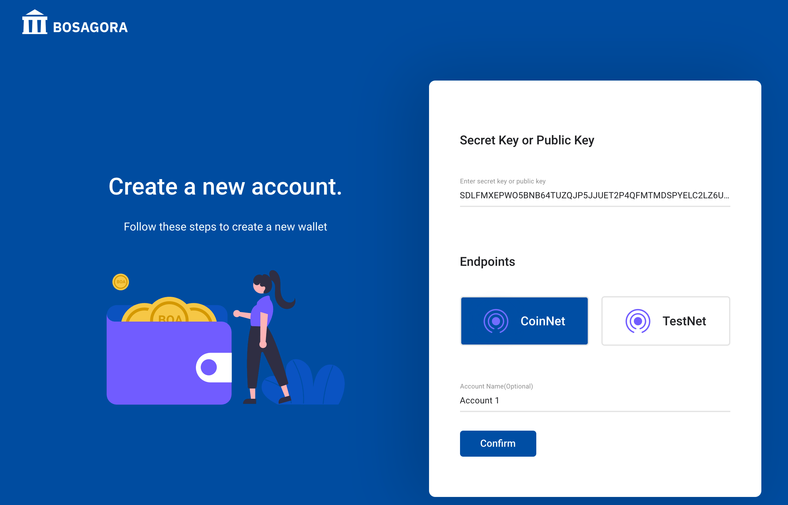
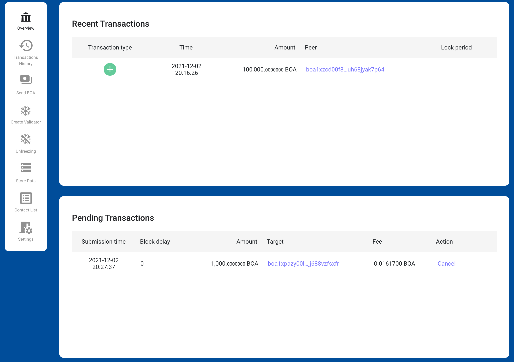

# 시작하기

## 로그인

등록된 계정이 하나도 없을 때, 월렛은 로그인 화면을 보여줍니다.  
이곳에서 사용자는 언어를 선택하고 새 계정 생성 버튼을 눌러 다음화면으로 이동합니다.  
사용자는 월렛에 있는 메뉴 설정을 이용하여 언어를 변경할 수 있습니다.

비밀키 또는 공개키와 계정의 이름을 입력한 후 확인 버튼을 누르면 월렛을 시작할 수 있습니다. 비밀키 또는 공개키를 가지고 있지 않은 사용자는 비밀키생성 버튼을 눌러 새로운 키를 생성할 수 있습니다. 월렛에서 생성된 비밀키는 월렛이 보관하지 않습니다. 사용자가 월렛을 다시 로그인할 때 비밀키를 입력하여야 합니다. 사용자가 비밀키를 백업해 두지 않았다면 그 계정에 이체된 자금을 사용할 수 없게 되므로 각별히 유의하여야 합니다.
계정에 대한 자세한 설명은 [계정의 관리](./01-introduction.md#manage-accounts)에 있습니다.

## 메뉴

모든 화면은 왼쪽에 메뉴를 가지고 있습니다. 
메뉴에는 개요, 트랜잭션 내역, BOA 전송, 검증자 생성, 언프리징, 데이터 저장, 연락처 목록, 설정이 있습니다. 

**개요**

상단에는 현재 선택된 계정에 대한 최근 10건의 트랜잭션내역이 있으며, 하단에는 현재 보류트랜잭션내역이 있습니다. 
또한 보류트랜잭션을 취소할 수 있는 기능이 제공됩니다.

**트랜잭션 내역**

사용자는 이곳에서 현재 선택된 계정의 과거 트랜잭션을 볼 수 있습니다.

**BOA 전송**

사용자는 이곳에서 다른 주소로 자금을 전송할 수 있습니다.

**검증자 생성**

BOASGORA의 네트워크에서 검증자 노드를 만들기 위해서는 40,000 BOA이상이 프리징되어야 합니다. 
사용자는 이곳에서 자금을 프리징할 수 있습니다. 
이 과정에서 노드운영을 위해 필요한 키페어가 추가적으로 생성됩니다. 이 키페어는 노드를 설정할 때 사용됩니다.

**언프리징**

사용자는 이곳에서 검증자를 만들기 위해 프리징된 자금을 해제할 수 있습니다.

**데이타 저장**

사용자는 이곳에서 블록체인에 데이터를 저장할 수 있습니다.

**연락처 목록**

연락처는 이체할 때 자주 사용하는 주소를 저장한 것입니다. 연락처는 사용자가 이체할 때 쉽게 주소를 선택할 수 있게 합니다. 따라서 사용자는 트랜잭션 내역에서도 상대방의 주소 대신 연락처에 등록한 연락처이름으로  쉽게 구분할 수 있습니다.

**설정**

사용자는 이곳에서 네트워크, 언어, 시간대 등을 설정할 수 있습니다.

## 상태바

**계정 선택**

사용자는 등록되어 있는 여러개의 계정중 하나를 선택할 수 있습니다. 또한 사용자는 계정의 공개키를 복사할 수 있으며 계정을 삭제할 수 있으며 새로운 계정을 추가할 수 있습니다

**네트워크 선택**

BOSAGORA에는 두 개의 네트워크가 존재합니다. 하나는 코인넷이고 다른 하나는 테스트넷입니다. 코인넷은 가치를 가지고 있는 실제 코인의 전송이 이루어지고 있는 네트워크입니다. 테스트넷은 테스트를 하기 위한 용도로 사용되며 여기의 코인은 실제가치를 가지고 있지 않습니다.

**잔고**

웹 월렛은 2가지 종류의 잔고를 보여줍니다. 하나는 선택된 계정의 잔고이고 다른 하나는 등록된 모든 계정의 합계입니다. 또한 하나의 계정에 대한 잔고를 세분화 하면 다음과 같습니다. 전체잔고 : 계정이 가진 모든 UTXO의 합계입니다. 지출가능 잔고 : 계정에서 지출이 가능한 UTXO의 합계입니다. 프리징 잔고 : 검증자 생성을 위해 프리징된 UTXO의 합계입니다. 잠긴 잔고 : 이것은 일정기간 동안 사용될 수 없는 UTXO의 합계입니다.
잠긴잔고는 두 가지 종류가 있습니다. 첫번째는 프리징된 UTXO가 언프리징 되어 새로 생성된 UTXO는 2016개의 새로운 블록이 생길 때까지 잠기게 됩니다. 두번째는 보류트랜잭션에 사용된 UTXO의 금액입니다. 트랜잭션에서 소비된 UTXO는 그것을 포함한 블록이 외부화 될때 까지 잠기게 됩니다.

**모드상태**

공개키는 계정에 반드시 등록되어 있지만 비밀키는 등록되어 있지 않을 수 있습니다. 비밀키가 등록된 계정의 모드는 Sudo입니다. 그렇지 않은 계정의 모드는 ReadOnly입니다. 그리고 웹 월렛은 Sudo의 갯수를 숫자를 표시하기 때문에 사용자가 현재 월렛에 등록된 비밀키의 갯수를 쉽게 파악할 수 있게 해줍니다.

## 개요

이 화면은 최근 트랜잭션과 보류 트랜잭션의 두 개의 영역으로 구성되어 있습니다.  

**최근 트랜잭션**

월렛은 블록체인에 저장된 최근 트랜잭션들 중 선택된 계정의 주소가 입금주소 또는 출금주소들 중 하나와 동일한 트랜잭션만을 보여줍니다. 
표시항목으로는 트랜잭션유형, 시간, 금액, 상대방 주소가 있습니다. 
가장 위의 레코드는 가장 최근에 생성된 트랜잭션입니다. 
하나의 레코드가 선택되면 상세한 트랜잭션정보가 제공됩니다.

* 트랜잭션유형은 입금, 출금, 프리징, 페이로드입니다.
    + 입금트랜잭션은 상대방 주소에서 선택된 계정으로 자금이 이체된 트랜잭션입니다.
    + 출금트랜잭션은 선택된 계정에서 상대방 주소로 자금이 이체된 트랜잭션입니다.
    + 프리징은 검증자 생성시 사용된 트랜잭션입니다.
    + 페이로드는 블록체인에 데이터를 저장하기 위해 사용된 트랜잭션입니다.
* 금액은 전송된 자금의 양입니다.
* 상대방 주소는 선택된 계정과 자금의 이동이 있었던 주소입니다.

**보류 트랜잭션**

월렛은 블록체인에 저장되기 위해 대기중인 트랜잭션들 중 선택된 계정의 주소가 보낸사람의 주소들 중 하나와 동일한 트랜잭션만을 보여줍니다. 
표시항목으로는 전송시간, 블록지연, 금액, 받는주소, 수수료, 기능이 있습니다.
전송시간은 Stoa가 트랜잭션을 수신한 시간입니다. 블록지연은 트랜잭션이 수신된 후에 외부화된 블록의 갯수입니다. 금액은 이체된 금액입니다. 받는주소는 자금을 받는 주소입니다. 수수료는 트랜잭션의 수수료입니다.
아직 블록에 저장되지 않은 트랜잭션은 취소될 수 있습니다. 취소되는 과정중에 블록에 저장될 가능이 있기 때문에 트랜잭션 취소의 성공은 보장될 수 없습니다.

## 트랜잭션 내역

월렛은 블록체인에 저장된 트랜잭션내역들 중 선택된 계정의 주소가 입금주소 또는 출금주소들 중 하나와 동일한 트랜잭션만을 보여줍니다. 
표시항목으로는 트랜잭션유형, 시간, 금액, 상대방 주소가 있습니다. 
가장 위의 레코드는 가장 최근에 생성된 트랜잭션입니다. 
하나의 레코드가 선택되면 상세한 트랜잭션 내용이 제공됩니다.

* 트랜잭션유형은 입금, 출금, 프리징, 페이로드입니다.
    + 입금트랜잭션은 상대방 주소에서 선택된 계정으로 자금이 이체된 트랜잭션입니다.
    + 출금트랜잭션은 선택된 계정에서 상대방 주소로 자금이 이체된 트랜잭션입니다.
    + 프리징은 검증자 생성시 사용된 트랜잭션입니다.
    + 페이로드는 블록체인에 데이터를 저장하기 위해 사용된 트랜잭션입니다.
* 금액은 전송된 자금의 양 입니다.
* 상대방 주소는 선택된 계정과 자금의 이동이 있었던 주소입니다.
