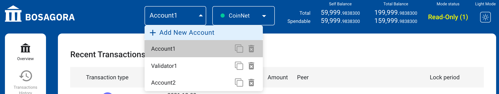
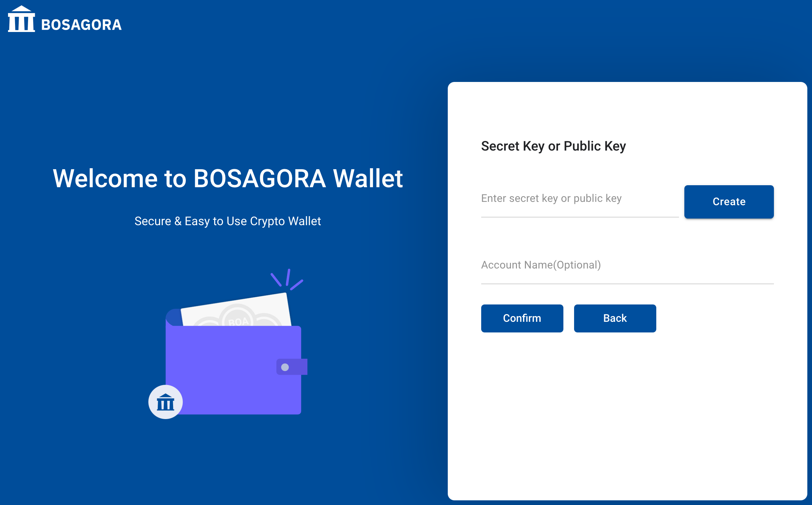
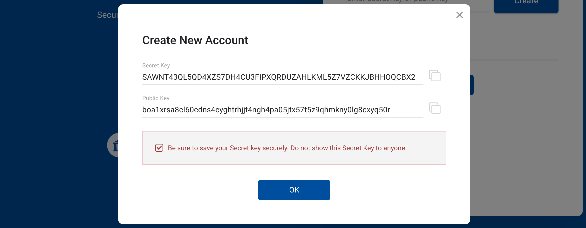

# 사용방법

## 계정을 추가하는 방법

화면 상단에 있는 계정을 클릭하면 "새로운 계정 추가"라는 메뉴가 나타납니다.

"새로운 계정 추가"를 클릭하면 아래 화면이 나타납니다. 이 곳에서 비밀키또는 공개키를 입력합니다. 

새로운 비밀키를 생성할 때는 "비밀키 생성"을 클릭합니다. 

새롭게 생성된 비밀키와 공개키를 복사합니다. 복사는 각 키의 오른쪽에 있는 아이콘을 클리하면 복사가 됩니다.
그리고 복사된 키를 별도의 저장소에 저장하여야 합니다. 다른 곳에서는 비밀키를 보여주는 곳이 없기 때문에 이 곳에서 반드시 다른 곳에 저장(백업)하여 두어야 합니다. 그리고 아래쪽 체크박스를 클릭합니다.
그리고 "확인" 버튼을 클릭하여 이 팝업창을 닫습니다.

그리고 복사해 둔 비밀키를 입력하고 계정의 이름을 입력합니다.
확인 버튼을 클릭합니다.

월렛은 새로운 계정이 추가하고 그 추가된 계정이 선택되도록 합니다.

## 공개키를 복사하는 방법
화면 상단에 있는 계정을 클릭하면 팝업메뉴가 나타납니다. 각 계정의 오른쪽에 아이콘이 2개 있습니다.
그 첫번째 아이콘이 각 계정이 가지고 있는 공개키를 클립보드로 복사하는 기능입니다.

## 계정을 삭제하는 방법
화면 상단에 있는 계정을 클릭하면 팝업메뉴가 나타납니다. 각 계정의 오른쪽에 아이콘이 2개 있습니다.
사용자가 두 번째 아이콘을 클릭하면 선택한 계정은 삭제됩니다.

## BOA를 전송하는 방법

사용자는 BOA를 원하는 주소로 전송하기 위해서 메뉴 **BOA 전송**을 선택하면 됩니다.

이 화면은 받는 주소, 수수료, 보내는 주소의 세 개의 영역으로 되어 있습니다.

**받는 주소**

자금이 입금되는 주소와 금액을 입력하는 부분입니다. 입금 주소는 연락처에서 선택될 수 있습니다.

**수수료**

수수료에 대한 자세한 설명은 [트랜잭션의 수수료][1]에 있습니다.

**보내는 주소**

표시항목은 주소, 인출할 금액, 필요한 금액, 지출가능한 잔고, 전체잔고, 기능 으로 구성됩니다. 
사용자는 보내는 계정을 여러개 추가하여 부족한 전송금액을 채울 수 있습니다. 
이 때 계정은 반드시 월렛에 먼저 등록되어 있어야 합니다.

* 주소 : 추가된 계정의 주소입니다.
* 인출할 금액 : 추가된 계정에서 인출될 금액입니다.
* 필요한 금액 : 전송금액을 채우기 위해 더 필요한 금액입니다.
* 지출가능한 잔고 : 추가된 계정에서 지출이 가능한 UTXO의 합계입니다.
* 전체잔고 : 추가된 계정이 가진 모든 UTXO의 합계입니다.

사용자가 하나의 계정을 추가한 후 필요한 금액이 0이면 더 이상 계정을 추가할 필요가 없습니다. 
그러나 필요한 금액이 0보다 크다면 새로운 계정을 추가하여야 합니다. 
추가된 계정의 필요한 금액이 0이라는 의미는 모든 계정의 지출가능한 잔고의 합이 전송금액보다 크거나 같다는 것입니다. 
이럴 경우 다음 버튼이 활성화됩니다. 사용자가 다음 버튼을 눌러 다음단계로 진행했을 때, 
월렛은 추가된 계정중에 공개키만 등록된 계정에 대해서 비밀키를 입력할 수 있는 창을 제공합니다.

**트랜잭션의 확인**

트랜잭션이 성공적으로 생성되면, 그 트랜잭션의 세부내용을 보여줍니다. 사용자는 금액과 주소를 최종적으로 확인하여야 합니다.

**트랜잭션의 전송**

확인 버튼을 클릭하면 트랜잭션은 노드로 전송됩니다. 
정상적으로 노드에 접수된 경우, 사용자는 화면 [개요][3] 하단의 보류트랜잭션에서 확인할 수 있습니다. 
또한 그 트랜잭션이 이미 블록체인에 저장되었다면 [트랜잭션의 내역][4]에서 그것을 확인할 수 있습니다.

## 검증자를 생성하는 방법

사용자는 검증자의 계정을 생성하기 위해서 메뉴 **검증자 생성**을 선택하면 됩니다.

이 화면은 프리징 금액, 검증자의 주소, 수수료, 보내는 주소 네 개의 영역으로 되어 있습니다.

**프리징 금액**

검증자가 되기 위해서는 40,000 BOA이상 프리징된 자금이 있어야 합니다. 
프리징 금액은 스테이킹 단위가 0일 때는 40,000 BOA이며 스테이킹 단위가 1증가 할 때마다 10,000 BOA씩 증가하게 됩니다.

**검증자의 주소**

검증자의 비밀키는 새롭게 만들어 사용됩니다. 
이 때 새로 만들어진 검증자의 비밀키는 계정에 바로 등록됩니다. 
사용자는 이 신규 검증자의 비밀키를 별로도 기록하고 보관하여야 합니다. 
그렇지 않으면 신규계정에 전송된 자금은 사용할 수 없게 됩니다.

**수수료**

수수료에 대한 자세한 설명은 [트랜잭션의 수수료][1]에 있습니다.

**보내는 주소**

표시항목은 주소, 인출할 금액, 필요한 금액, 지출가능한 잔고, 전체잔고, 기능 으로 구성됩니다. 
사용자는 보내는 계정을 여러개 추가하여 부족한 전송금액을 채울 수 있습니다. 
이 때 계정은 반드시 월렛에 먼저 등록되어 있어야 합니다.

* 주소 : 추가된 계정의 주소입니다.
* 인출할 금액 : 추가된 계정에서 인출될 금액입니다.
* 필요한 금액 : 전송금액을 채우기 위해 더 필요한 금액입니다.
* 지출가능한 잔고 : 추가된 계정에서 지출이 가능한 UTXO의 합계입니다.
* 전체잔고 : 추가된 계정이 가진 모든 UTXO의 합계입니다.

사용자가 하나의 계정을 추가한 후 필요한 금액이 0이면 더 이상 계정을 추가할 필요가 없습니다. 
그러나 필요한 금액이 0보다 크다면 새로운 계정을 추가하여야 합니다. 
추가된 계정의 필요한 금액이 0이라는 의미는 모든 계정의 지출가능한 잔고의 합이 전송금액보다 크거나 같다는 것입니다. 
이럴 경우 다음 버튼이 활성화됩니다. 사용자가 다음 버튼을 눌러 다음단계로 진행했을 때, 
월렛은 추가된 계정중에 공개키만 등록된 계정에 대해서 비밀키를 입력할 수 있는 창을 제공합니다.

**트랜잭션의 확인**

트랜잭션이 성공적으로 생성되면, 그 트랜잭션의 세부내용을 보여줍니다. 사용자는 금액과 주소를 최종적으로 확인하여야 합니다.

**트랜잭션의 전송**

확인 버튼을 클릭하면 트랜잭션은 노드로 전송됩니다. 
정상적으로 노드에 접수된 경우, 사용자는 화면 [개요][3] 하단의 보류트랜잭션에서 확인할 수 있습니다. 
또한 그 트랜잭션이 이미 블록체인에 저장되었다면 [트랜잭션의 내역][4]에서 그것을 확인할 수 있습니다.

## 언프리징하는 방법

사용자는 프리징된 자금을 해제하기 위해서 메뉴 **언프리징**을 선택하면 됩니다.

이 화면은 프리징된 UTXO의 선택, 수수료 두 개의 영역으로 되어 있습니다.

**프리징된 UTXO의 선택**

현재 선택된 계정에 있는 프리징된 UTXO를 보여줍니다. 사용자는 언프리징을 원하는 항목의 왼쪽 체크박스를 선택합니다.

**수수료**

수수료에 대한 자세한 설명은 트랜잭션의 수수료에 있습니다.

**트랜잭션의 확인**

트랜잭션이 성공적으로 생성되면, 그 트랜잭션의 세부내용을 보여줍니다. 사용자는 금액과 주소를 최종적으로 확인하여야 합니다.

**트랜잭션의 전송**

확인 버튼을 클릭하면 트랜잭션은 노드로 전송됩니다. 
정상적으로 노드에 접수된 경우, 사용자는 화면 [개요][3] 하단의 보류트랜잭션에서 확인할 수 있습니다. 
또한 그 트랜잭션이 이미 블록체인에 저장되었다면 [트랜잭션의 내역][4]에서 그것을 확인할 수 있습니다.

## 블록체인에 데이타를 저장하는 방법

사용자는 블록체인에 데이타를 저장하기 위해서 메뉴 **데이타저장**을 선택하면 됩니다.

이 화면은 페이로드, 수수료, 보내는 주소 세 개의 영역으로 되어 있습니다.

**[페이로드][2]**

블록체인에 저장할 데이터입니다. Base64로 엔코딩된 텍스트가 입력되여야 합니다.

**수수료**

수수료에 대한 자세한 설명은 [트랜잭션의 수수료][1]에 있습니다.

**보내는 주소**

표시항목은 주소, 인출할 금액, 필요한 금액, 지출가능한 잔고, 전체잔고, 기능 으로 구성됩니다. 
사용자는 보내는 계정을 여러개 추가하여 부족한 전송금액을 채울 수 있습니다. 
이 때 계정은 반드시 월렛에 먼저 등록되어 있어야 합니다.

* 주소 : 추가된 계정의 주소입니다.
* 인출할 금액 : 추가된 계정에서 인출될 금액입니다.
* 필요한 금액 : 전송금액을 채우기 위해 더 필요한 금액입니다.
* 지출가능한 잔고 : 추가된 계정에서 지출이 가능한 UTXO의 합계입니다.
* 전체잔고 : 추가된 계정이 가진 모든 UTXO의 합계입니다.

사용자가 하나의 계정을 추가한 후 필요한 금액이 0이면 더 이상 계정을 추가할 필요가 없습니다. 
그러나 필요한 금액이 0보다 크다면 새로운 계정을 추가하여야 합니다. 
추가된 계정의 필요한 금액이 0이라는 의미는 모든 계정의 지출가능한 잔고의 합이 전송금액보다 크거나 같다는 것입니다. 
이럴 경우 다음 버튼이 활성화됩니다. 사용자가 다음 버튼을 눌러 다음단계로 진행했을 때, 
월렛은 추가된 계정중에 공개키만 등록된 계정에 대해서 비밀키를 입력할 수 있는 창을 제공합니다.

**트랜잭션의 확인**

트랜잭션이 성공적으로 생성되면, 그 트랜잭션의 세부내용을 보여줍니다. 사용자는 금액과 주소를 최종적으로 확인하여야 합니다.

**트랜잭션의 전송**

확인 버튼을 클릭하면 트랜잭션은 노드로 전송됩니다. 
정상적으로 노드에 접수된 경우, 사용자는 화면 [개요][3] 하단의 보류트랜잭션에서 확인할 수 있습니다. 
또한 그 트랜잭션이 이미 블록체인에 저장되었다면 [트랜잭션의 내역][4]에서 그것을 확인할 수 있습니다.

## 연락처를 관리하는 방법

사용자는 자금의 전송을 쉽게 하기 위해 상대방의 주소를 저장할 수 있습니다.
사용자는 메뉴 **연락처 목록**을 선택하면 됩니다.

연락처는 주소와 이름으로 구성됩니다. 사용자의 계좌에서 연락처에 등록된 주소로 자금을 쉽게 전송할 수 있게 해줍니다. 또한 월렛은 트랜잭션의 내역에서 연락처에 등록된 주소를 대신하여 이름으로 표시합니다. 따라서 사용자는 쉽게 그 트랜잭션의 내용을 쉽게 파악할 수 있습니다.

**연락처 추가**

오른쪽 상단에 있는 연락처 추가 버튼이 클릭되면 입력창이 팝업됩니다. 사용자는 이곳에 주소와 연락처의 이름을 입력하여 추가 할 수 있습니다.

**연락처 수정**

사용자는 각 연락처의 항목 오른쪽 있는 수정버튼을 클릭하여 연락처의 이름을 변경할 수 있습니다.

**연락처 삭제**

사용자는 각 연락처의 항목 오른쪽에 있는 삭제버튼을 클릭하여 연락처를 삭제할 수 있습니다.

## 월렛의 다양한 설정

**언어**

제공되는 언어는 영어, 한국어, 중국어 입니다.

**Endpoints**

CoinNet과 TestNet의 주소를 네트워크의 접속 주소를 확인하고 변경할 수 있습니다.

**월렛 상태 초기화**

저장되어 있던 계정과 연락처가 모두 삭제됩니다.

**시간대**

제공되는 시간대는 지역시간과 UTC입니다.

**다크모드**

화면의 배경색을 변경할 수 있습니다. 다크모드와 라이트모드가 제공됩니다.

[1]:./01-introduction.md#트랜잭션의-수수료
[2]:./01-introduction.md#페이로드와-페이로드-수수료
[3]:./02-getting-started.md#개요
[4]:./02-getting-started.md#트랜잭션-내역
