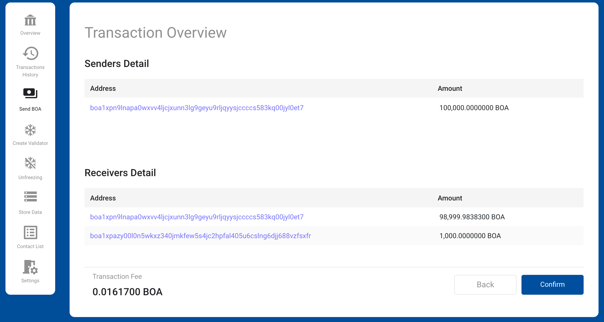
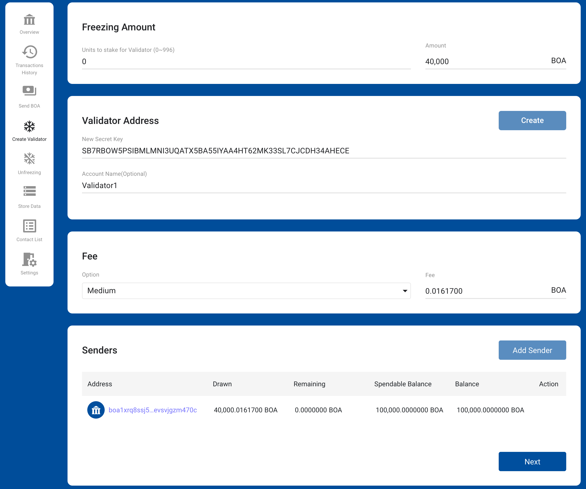
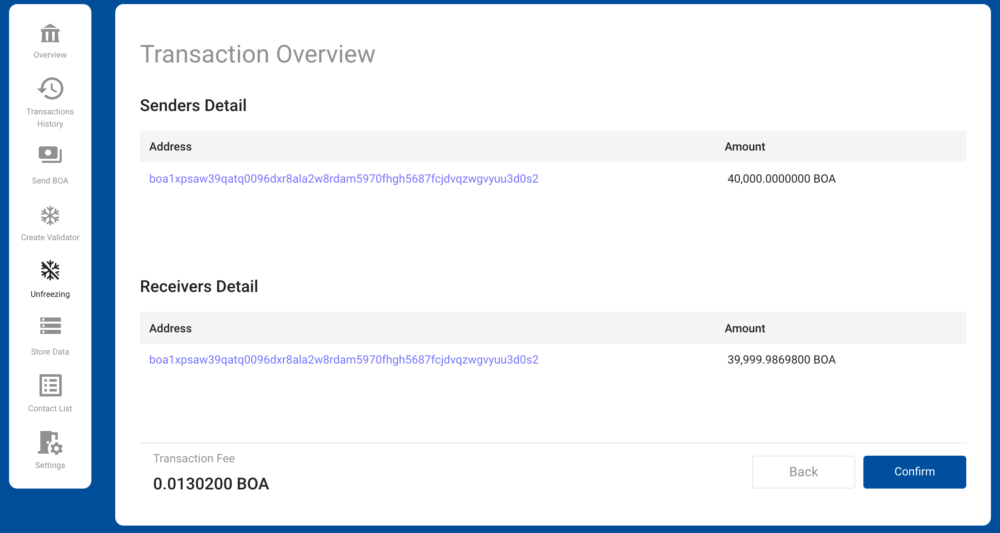
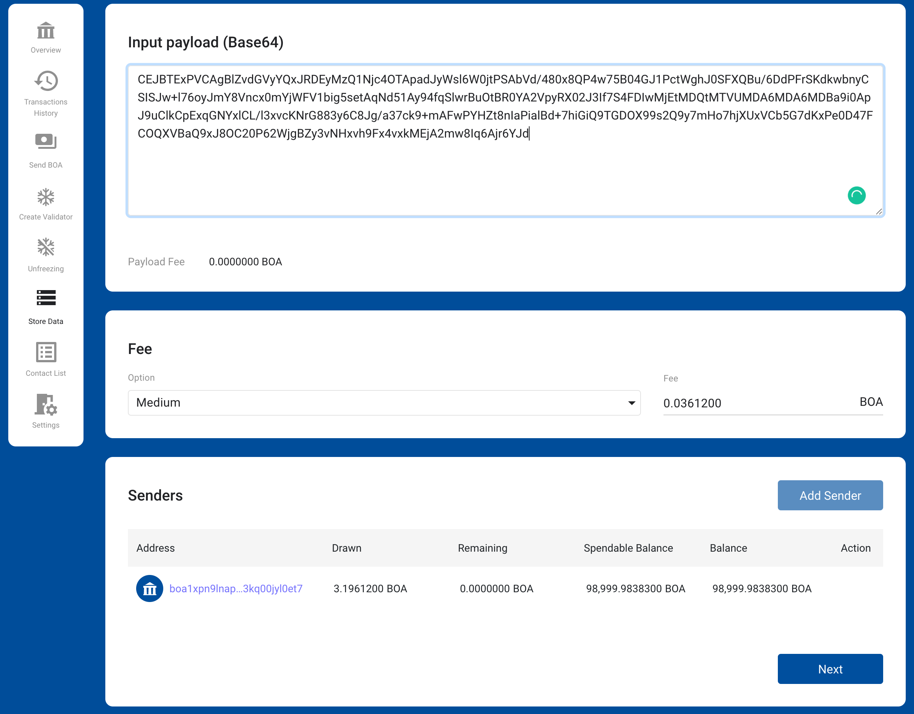

# How to

## How to Add an Account?

Click on the account at the top of the screen, 
and you will see a menu called "Add New Account".  

Click "Add a new account", and you will see the screen below. 
Enter a secret key or public key here. 

When creating a new secret key, click the button "Create".  

Copy the newly created secret key and public key. 
You can click and "Copy" the icon to the right of each key, 
store the copied key in a separate storage, 
click the check box below, 
and then click the button "OK" to close this pop-up window.

You may enter the secret key you copied and the name of the account, and click the button "OK."

The wallet adds a new account and allows the added account to be selected.

## How to Copy the Public Key?

When you click the account at the top of the screen, a pop-up menu appears. 
There are two icons to the right of each account. 
The first icon is the ability to copy the public key each account has to the clipboard.

## How to Delete an Account?

Click on the account at the top of the screen to see a pop-up menu. 
There are two icons to the right of each account. 
When clicking on the second icon, the selected account is deleted.

## How to Send BOA?

You can select the menu "Send BOA" to send the BOA to the desired address.  
This screen consists of three areas: Receivers, Fee, and Senders.  

**Receivers**

This is where you enter the receiving address and amount. 
The receiving address can be selected from the contact list.

**Fee**

A detailed description of the fee is [here][1].

**Senders**

This section consists of Address, Drawn, Remaining, Spendable Balance, Balance, and Action.
You can make up for an insufficient transfer amount in one account,
by adding or combining a sum from your other accounts.
However, before doing this, the accounts must be first registered in the wallet.

* Address : The address of the added account.
* Drawn : The amount that would be withdrawn on the added account.
* Remaining : The amount needed to fill the sending amount.
* Spendable Balance : The sum of UTXO that can be spent on the added account.
* Balance : The sum of all UTXOs held by the account.

If the Remaining is zero after you add one account, 
you no longer need to add an account. However, 
if the Remaining is greater than 0, a new account must be added. 
If added account's Remaining is zero, 
it means that the sum of the spendable balances of all accounts is greater than or equal to the transfer amount.
In this case, the button "Next" is activated. 
When you press the button "Next" to proceed to the next step, 
the wallet provides a window for entering a secret key for an account 
with only a public key registered among the added accounts.

**Transaction Overview**

When a transaction is successfully created, 
it shows the details of the transaction. To finalize, 
you must check the amount and address after making a transaction.

**Send Transaction**

After clicking the button "OK", the transaction is sent to the node. 
If the transaction is successfully received by the node, 
you can check the pending transactions on the [Overview][3]. 
Also, if the transaction has already been stored in the blockchain, 
you can check it in your [Transactions History][4]. 

## How to Create a Validator?

Select "Create Validator" in the menu to create the validator's account.  
This section consists of Freezing Amount, Validator Address, Fee, and Senders.

**Freezing Amount**

To become a validator, you need to have more than 40,000 BOA of frozen funds.
The freezing amount is 40,000 BOA when the staking unit is zero, 
and each time the staking unit increases by 1, it increases by 10,000 BOA.

**Validator Address**

The validator's secret key is newly created and used. When this happens, 
the newly created validator's secret key is registered directly to the account. 
The user must record and keep the secret key of this new validator separately. 
Otherwise, the funds transferred to the new account will not be available.

**Fee**

A detailed description of the fee is [here][1].

**Senders**

This section consists of Address, Drawn, Remaining, Spendable Balance, Balance, and Action.
You can make up for an insufficient transfer amount in one account,
by adding or combining a sum from your other accounts.
However, before doing this, the accounts must be first registered in the wallet.

* Address : The address of the added account.
* Drawn : The amount that would be withdrawn on the added account.
* Remaining : The amount needed to fill the sending amount.
* Spendable Balance : The sum of UTXO that can be spent on the added account.
* Balance : The sum of all UTXOs held by the account.

If the Remaining is zero after you add one account, you no longer need to add an account. 
However, if the Remaining is greater than 0, a new account must be added. 
If added account's Remaining is zero, 
it means that the sum of the spendable balances of all accounts is greater than or equal to the transfer amount. 
In this case, the button "Next" is activated. 
When you press the button "Next" to proceed to the next step, 
the wallet provides a window for entering a secret key for an account 
with only a public key registered among the added accounts.

**Transaction Overview**

When a transaction is successfully created, it shows the details of the transaction. 
To finalize, you must check the amount and address after making a transaction.

**Send Transaction**

After clicking the button "OK", the transaction is sent to the node. 
If the transaction is successfully received by the node, 
you can check the pending transactions on the [Overview][3].
Also, if the transaction has already been stored in the blockchain, 
you can check it in your [Transactions History][4].

## How to Unfreeze?

You can select the menu "Unfreezing" to release the frozen funds. 
This screen consists of two sections: Select UTXO and Fee. 

**Select UTXO**
 
Shows the frozen UTXO currently in the selected account.
You can select the left check box of the item you want to unfreeze.

**Fee**

A detailed description of the fee is [here][1].

**Transaction Overview**

When a transaction is successfully created, 
it shows the details of the transaction. 
To finalize, you must check the amount and address after making a transaction.

**Send Transaction**

After clicking the button "OK", the transaction is sent to the node. 
If the transaction is successfully received by the node, 
you can check the pending transactions on the [Overview][3]. 
Also, if the transaction has already been stored in the blockchain, 
you can check it in your [Transactions History][4].

## How to Store Data in Blockchain?

You can select the menu "Store Data" to store data in the blockchain.  
This screen consists of three sections: Payload, Fee, and Senders.

**[Payload][2]**

Data to be stored in the blockchain. Text encoded with Base64 must be entered.

**Fee**

A detailed description of the fee is [here][1].

**Senders**

This section consists of Address, Drawn, Remaining, Spendable Balance, Balance, and Action. 
You can make up for an insufficient transfer amount in one account, 
by adding or combining a sum from your other accounts. 
However, before doing this, the accounts must be first registered in the wallet.

* Address : The address of the added account.
* Drawn : The amount that would be withdrawn on the added account.
* Remaining : The amount needed to fill the sending amount.
* Spendable Balance : The sum of UTXO that can be spent on the added account.
* Balance : The sum of all UTXOs held by the account.

If the Remaining is zero after you add one account, 
you no longer need to add an account. However, 
if the Remaining is greater than 0, a new account must be added. 
If added account's Remaining is zero, 
it means that the sum of the spendable balances of all accounts is greater than or equal to the transfer amount. 
In this case, the button "Next" is activated. When you press the button "Next" to proceed to the next step, 
the wallet provides a window for entering a secret key for an account with only a public key registered 
among the added accounts.
 

**Transaction Overview**

When a transaction is successfully created, it shows the details of the transaction. To finalize,
you must check the amount and address after making a transaction.

**Send Transaction**

After clicking the button "OK", the transaction is sent to the node.
If the transaction is successfully received by the node, you can check the pending transactions on the [Overview][3].
Also, if the transaction has already been stored in the blockchain, 
you can check it in your [Transactions History][4].

## How to Use the Contact List?

You can save the address of the other party. The user can select the menu "Contact List".

The contact information consists of address and name. 
It makes it easy and safe to transfer funds from your account to an address registered in your contact number. 
The wallet also displays the transaction history as a name on behalf of the address registered in the contact. 
Therefore, users can easily grasp the content of the transaction.

**Add Contact**

When the button "Add Contact" on the top right is clicked, 
the input window pops up. You can add by entering their address and contact name here.

**Edit Contact**

You can change the contact's name by clicking the icon "Edit" to the right of each contact's item.

**Delete Contact**

You can delete the contact by clicking the icon "Delete" to the right of each contact's item.

## How to set the wallet?

**Language**

You can choose between English, Korean, and Chinese.

**Endpoints**

You can check and change the endpoints of CoinNet and TestNet.

**Reset Wallet State**

All saved accounts and contacts will be deleted.

**Timezone**

You can choose between Local Time and UTC.

**Dark Mode**

You can change the background color of the screen to Dark Mode or Light Mode.

[1]:./01-introduction.md#transaction-fee
[2]:./01-introduction.md#payload-and-payload-fee
[3]:./02-getting-started.md#overview
[4]:./02-getting-started.md#transactions-history

